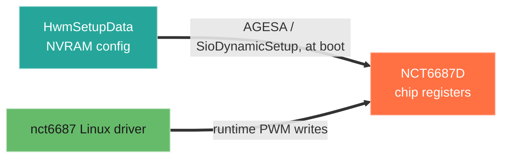

<!-- BEGIN GENERATED -->
# NVRAM variable: `HwmSetupData`

GUID `B4B6D1E7-039D-4CEF-8742-BA34DA443ECE`

Parameters bound to this variable, by offset (the no-flash edit map):

| Offset | Bits | Parameter | Menu |
|---|--:|---|---|
| `0x0` | 32 | [[Hardware_Monitor_Major_Version]] | [[Hardware_Monitor|Hardware Monitor]] |
| `0x4` | 32 | [[Hardware_Monitor_Minor_Version]] | [[Hardware_Monitor|Hardware Monitor]] |
| `0x8` | 8 | [[Voltage_Amount]] | [[Hardware_Monitor|Hardware Monitor]] |
| `0x9` | 8 | [[Temperature_Amount]] | [[Hardware_Monitor|Hardware Monitor]] |
| `0xA` | 8 | [[Fan_Amount]] | [[Hardware_Monitor|Hardware Monitor]] |
| `0xB` | 8 | [[CPU_Fan_1_Smart_Fan_Control]] | [[CPU_Fan_1|CPU Fan 1]] |
| `0xC` | 32 | [[CPU_Fan_1_temperature_source_select]] | [[CPU_Fan_1|CPU Fan 1]] |
| `0x10` | 8 | [[CPU_Fan_1_fan_type_auto_detect]] | [[CPU_Fan_1|CPU Fan 1]] |
| `0x11` | 8 | [[CPU_Fan_1_current_fan_control_mode]] | [[CPU_Fan_1|CPU Fan 1]] |
| `0x12` | 8 | [[CPU_Fan_1_fan_fail]] | [[CPU_Fan_1|CPU Fan 1]] |
| `0x13` | 8 | [[CPU_Fan_1_level_select]] | [[CPU_Fan_1|CPU Fan 1]] |
| `0x14` | 8 | [[CPU_Fan_1_level_1_Temperature]] | [[CPU_Fan_1|CPU Fan 1]] |
| `0x15` | 8 | [[CPU_Fan_1_level_2_Temperature]] | [[CPU_Fan_1|CPU Fan 1]] |
| `0x16` | 8 | [[CPU_Fan_1_level_3_Temperature]] | [[CPU_Fan_1|CPU Fan 1]] |
| `0x17` | 8 | [[CPU_Fan_1_level_4_Temperature]] | [[CPU_Fan_1|CPU Fan 1]] |
| `0x18` | 8 | [[CPU_Fan_1_level_5_Temperature]] | [[CPU_Fan_1|CPU Fan 1]] |
| `0x19` | 8 | [[CPU_Fan_1_level_6_Temperature]] | [[CPU_Fan_1|CPU Fan 1]] |
| `0x1A` | 8 | [[CPU_Fan_1_level_7_Temperature]] | [[CPU_Fan_1|CPU Fan 1]] |
| `0x1B` | 8 | [[CPU_Fan_1_level_add_Temperature]] | [[CPU_Fan_1|CPU Fan 1]] |
| `0x1C` | 8 | [[CPU_Fan_1_critical_temperature]] | [[CPU_Fan_1|CPU Fan 1]] |
| `0x1D` | 8 | [[CPU_Fan_1_level_1_Fan_Speed]] | [[CPU_Fan_1|CPU Fan 1]] |
| `0x1E` | 8 | [[CPU_Fan_1_level_2_Fan_Speed]] | [[CPU_Fan_1|CPU Fan 1]] |
| `0x1F` | 8 | [[CPU_Fan_1_level_3_Fan_Speed]] | [[CPU_Fan_1|CPU Fan 1]] |
| `0x20` | 8 | [[CPU_Fan_1_level_4_Fan_Speed]] | [[CPU_Fan_1|CPU Fan 1]] |
| `0x21` | 8 | [[CPU_Fan_1_level_5_Fan_Speed]] | [[CPU_Fan_1|CPU Fan 1]] |
| `0x22` | 8 | [[CPU_Fan_1_level_6_Fan_Speed]] | [[CPU_Fan_1|CPU Fan 1]] |
| `0x23` | 8 | [[CPU_Fan_1_level_7_Fan_Speed]] | [[CPU_Fan_1|CPU Fan 1]] |
| `0x24` | 8 | [[CPU_Fan_1_level_add_Fan_Speed]] | [[CPU_Fan_1|CPU Fan 1]] |
| `0x25` | 16 | [[CPU_Fan_1_level_1_Fan_Speed_(V)]] | [[CPU_Fan_1|CPU Fan 1]] |
| `0x27` | 16 | [[CPU_Fan_1_level_2_Fan_Speed_(V)]] | [[CPU_Fan_1|CPU Fan 1]] |
| `0x29` | 16 | [[CPU_Fan_1_level_3_Fan_Speed_(V)]] | [[CPU_Fan_1|CPU Fan 1]] |
| `0x2B` | 16 | [[CPU_Fan_1_level_4_Fan_Speed_(V)]] | [[CPU_Fan_1|CPU Fan 1]] |
| `0x2D` | 16 | [[CPU_Fan_1_level_5_Fan_Speed_(V)]] | [[CPU_Fan_1|CPU Fan 1]] |
| `0x2F` | 16 | [[CPU_Fan_1_level_6_Fan_Speed_(V)]] | [[CPU_Fan_1|CPU Fan 1]] |
| `0x31` | 16 | [[CPU_Fan_1_level_7_Fan_Speed_(V)]] | [[CPU_Fan_1|CPU Fan 1]] |
| `0x33` | 16 | [[CPU_Fan_1_level_add_Fan_Speed_(V)]] | [[CPU_Fan_1|CPU Fan 1]] |
| `0x35` | 8 | [[CPU_Fan_1_step_up_time]] | [[CPU_Fan_1|CPU Fan 1]] |
| `0x36` | 8 | [[CPU_Fan_1_step_down_time]] | [[CPU_Fan_1|CPU Fan 1]] |
| `0x37` | 8 | [[CPU_Fan_1_Group_Fan_ComboBox]] | [[CPU_Fan_1|CPU Fan 1]] |
| `0x4F` | 8 | [[PUMP_Fan_1_Smart_Fan_Control]] | [[PUMP_Fan_1|PUMP Fan 1]] |
| `0x50` | 32 | [[PUMP_Fan_1_temperature_source_select]] | [[PUMP_Fan_1|PUMP Fan 1]] |
| `0x54` | 8 | [[PUMP_Fan_1_fan_type_auto_detect]] | [[PUMP_Fan_1|PUMP Fan 1]] |
| `0x55` | 8 | [[PUMP_Fan_1_current_fan_control_mode]] | [[PUMP_Fan_1|PUMP Fan 1]] |
| `0x56` | 8 | [[PUMP_Fan_1_fan_fail]] | [[PUMP_Fan_1|PUMP Fan 1]] |
| `0x57` | 8 | [[PUMP_Fan_1_level_select]] | [[PUMP_Fan_1|PUMP Fan 1]] |
| `0x58` | 8 | [[PUMP_Fan_1_level_1_Temperature]] | [[PUMP_Fan_1|PUMP Fan 1]] |
| `0x59` | 8 | [[PUMP_Fan_1_level_2_Temperature]] | [[PUMP_Fan_1|PUMP Fan 1]] |
| `0x5A` | 8 | [[PUMP_Fan_1_level_3_Temperature]] | [[PUMP_Fan_1|PUMP Fan 1]] |
| `0x5B` | 8 | [[PUMP_Fan_1_level_4_Temperature]] | [[PUMP_Fan_1|PUMP Fan 1]] |
| `0x5C` | 8 | [[PUMP_Fan_1_level_5_Temperature]] | [[PUMP_Fan_1|PUMP Fan 1]] |
| `0x5D` | 8 | [[PUMP_Fan_1_level_6_Temperature]] | [[PUMP_Fan_1|PUMP Fan 1]] |
| `0x5E` | 8 | [[PUMP_Fan_1_level_7_Temperature]] | [[PUMP_Fan_1|PUMP Fan 1]] |
| `0x5F` | 8 | [[PUMP_Fan_1_level_add_Temperature]] | [[PUMP_Fan_1|PUMP Fan 1]] |
| `0x60` | 8 | [[PUMP_Fan_1_critical_temperature]] | [[PUMP_Fan_1|PUMP Fan 1]] |
| `0x61` | 8 | [[PUMP_Fan_1_Fan_Speed]] | [[PUMP_Fan_1|PUMP Fan 1]] |
| `0x62` | 8 | [[PUMP_Fan_1_level_1_Fan_Speed]] | [[PUMP_Fan_1|PUMP Fan 1]] |
| `0x63` | 8 | [[PUMP_Fan_1_level_2_Fan_Speed]] | [[PUMP_Fan_1|PUMP Fan 1]] |
| `0x64` | 8 | [[PUMP_Fan_1_level_3_Fan_Speed]] | [[PUMP_Fan_1|PUMP Fan 1]] |
| `0x65` | 8 | [[PUMP_Fan_1_level_4_Fan_Speed]] | [[PUMP_Fan_1|PUMP Fan 1]] |
| `0x66` | 8 | [[PUMP_Fan_1_level_5_Fan_Speed]] | [[PUMP_Fan_1|PUMP Fan 1]] |
| `0x67` | 8 | [[PUMP_Fan_1_level_6_Fan_Speed]] | [[PUMP_Fan_1|PUMP Fan 1]] |
| `0x68` | 8 | [[PUMP_Fan_1_level_7_Fan_Speed]] | [[PUMP_Fan_1|PUMP Fan 1]] |
| `0x69` | 8 | [[PUMP_Fan_1_level_add_Fan_Speed]] | [[PUMP_Fan_1|PUMP Fan 1]] |
| `0x6A` | 16 | [[PUMP_Fan_1_Fan_Speed_(V)]] | [[PUMP_Fan_1|PUMP Fan 1]] |
| `0x6C` | 16 | [[PUMP_Fan_1_level_1_Fan_Speed_(V)]] | [[PUMP_Fan_1|PUMP Fan 1]] |
| `0x6E` | 16 | [[PUMP_Fan_1_level_2_Fan_Speed_(V)]] | [[PUMP_Fan_1|PUMP Fan 1]] |
| `0x70` | 16 | [[PUMP_Fan_1_level_3_Fan_Speed_(V)]] | [[PUMP_Fan_1|PUMP Fan 1]] |
| `0x72` | 16 | [[PUMP_Fan_1_level_4_Fan_Speed_(V)]] | [[PUMP_Fan_1|PUMP Fan 1]] |
| `0x74` | 16 | [[PUMP_Fan_1_level_5_Fan_Speed_(V)]] | [[PUMP_Fan_1|PUMP Fan 1]] |
| `0x76` | 16 | [[PUMP_Fan_1_level_6_Fan_Speed_(V)]] | [[PUMP_Fan_1|PUMP Fan 1]] |
| `0x78` | 16 | [[PUMP_Fan_1_level_7_Fan_Speed_(V)]] | [[PUMP_Fan_1|PUMP Fan 1]] |
| `0x7A` | 16 | [[PUMP_Fan_1_level_add_Fan_Speed_(V)]] | [[PUMP_Fan_1|PUMP Fan 1]] |
| `0x7C` | 8 | [[PUMP_Fan_1_step_up_time]] | [[PUMP_Fan_1|PUMP Fan 1]] |
| `0x7D` | 8 | [[PUMP_Fan_1_step_down_time]] | [[PUMP_Fan_1|PUMP Fan 1]] |
| `0x7E` | 8 | [[PUMP_Fan_1_Group_Fan_ComboBox]] | [[PUMP_Fan_1|PUMP Fan 1]] |
| `0xC7` | 8 | [[PUMP_SYS_Fan_1_Smart_Fan_Control]] | [[PUMP_SYS_Fan_1|PUMP_SYS Fan 1]] |
| `0xC8` | 32 | [[PUMP_SYS_Fan_1_temperature_source_select]] | [[PUMP_SYS_Fan_1|PUMP_SYS Fan 1]] |
| `0xCC` | 8 | [[PUMP_SYS_Fan_1_fan_type_auto_detect]] | [[PUMP_SYS_Fan_1|PUMP_SYS Fan 1]] |
| `0xCD` | 8 | [[PUMP_SYS_Fan_1_current_fan_control_mode]] | [[PUMP_SYS_Fan_1|PUMP_SYS Fan 1]] |
| `0xCE` | 8 | [[PUMP_SYS_Fan_1_fan_fail]] | [[PUMP_SYS_Fan_1|PUMP_SYS Fan 1]] |
| `0xCF` | 8 | [[PUMP_SYS_Fan_1_level_select]] | [[PUMP_SYS_Fan_1|PUMP_SYS Fan 1]] |
| `0xD0` | 8 | [[PUMP_SYS_Fan_1_level_1_Temperature]] | [[PUMP_SYS_Fan_1|PUMP_SYS Fan 1]] |
| `0xD1` | 8 | [[PUMP_SYS_Fan_1_level_2_Temperature]] | [[PUMP_SYS_Fan_1|PUMP_SYS Fan 1]] |
| `0xD2` | 8 | [[PUMP_SYS_Fan_1_level_3_Temperature]] | [[PUMP_SYS_Fan_1|PUMP_SYS Fan 1]] |
| `0xD3` | 8 | [[PUMP_SYS_Fan_1_level_4_Temperature]] | [[PUMP_SYS_Fan_1|PUMP_SYS Fan 1]] |
| `0xD4` | 8 | [[PUMP_SYS_Fan_1_level_5_Temperature]] | [[PUMP_SYS_Fan_1|PUMP_SYS Fan 1]] |
| `0xD5` | 8 | [[PUMP_SYS_Fan_1_level_6_Temperature]] | [[PUMP_SYS_Fan_1|PUMP_SYS Fan 1]] |
| `0xD6` | 8 | [[PUMP_SYS_Fan_1_level_7_Temperature]] | [[PUMP_SYS_Fan_1|PUMP_SYS Fan 1]] |
| `0xD7` | 8 | [[PUMP_SYS_Fan_1_level_add_Temperature]] | [[PUMP_SYS_Fan_1|PUMP_SYS Fan 1]] |
| `0xD8` | 8 | [[PUMP_SYS_Fan_1_critical_temperature]] | [[PUMP_SYS_Fan_1|PUMP_SYS Fan 1]] |
| `0xD9` | 8 | [[PUMP_SYS_Fan_1_Fan_Speed]] | [[PUMP_SYS_Fan_1|PUMP_SYS Fan 1]] |
| `0xDA` | 8 | [[PUMP_SYS_Fan_1_level_1_Fan_Speed]] | [[PUMP_SYS_Fan_1|PUMP_SYS Fan 1]] |
| `0xDB` | 8 | [[PUMP_SYS_Fan_1_level_2_Fan_Speed]] | [[PUMP_SYS_Fan_1|PUMP_SYS Fan 1]] |
| `0xDC` | 8 | [[PUMP_SYS_Fan_1_level_3_Fan_Speed]] | [[PUMP_SYS_Fan_1|PUMP_SYS Fan 1]] |
| `0xDD` | 8 | [[PUMP_SYS_Fan_1_level_4_Fan_Speed]] | [[PUMP_SYS_Fan_1|PUMP_SYS Fan 1]] |
| `0xDE` | 8 | [[PUMP_SYS_Fan_1_level_5_Fan_Speed]] | [[PUMP_SYS_Fan_1|PUMP_SYS Fan 1]] |
| `0xDF` | 8 | [[PUMP_SYS_Fan_1_level_6_Fan_Speed]] | [[PUMP_SYS_Fan_1|PUMP_SYS Fan 1]] |
| `0xE0` | 8 | [[PUMP_SYS_Fan_1_level_7_Fan_Speed]] | [[PUMP_SYS_Fan_1|PUMP_SYS Fan 1]] |
| `0xE1` | 8 | [[PUMP_SYS_Fan_1_level_add_Fan_Speed]] | [[PUMP_SYS_Fan_1|PUMP_SYS Fan 1]] |
| `0xE2` | 16 | [[PUMP_SYS_Fan_1_Fan_Speed_(V)]] | [[PUMP_SYS_Fan_1|PUMP_SYS Fan 1]] |
| `0xE4` | 16 | [[PUMP_SYS_Fan_1_level_1_Fan_Speed_(V)]] | [[PUMP_SYS_Fan_1|PUMP_SYS Fan 1]] |
| `0xE6` | 16 | [[PUMP_SYS_Fan_1_level_2_Fan_Speed_(V)]] | [[PUMP_SYS_Fan_1|PUMP_SYS Fan 1]] |
| `0xE8` | 16 | [[PUMP_SYS_Fan_1_level_3_Fan_Speed_(V)]] | [[PUMP_SYS_Fan_1|PUMP_SYS Fan 1]] |
| `0xEA` | 16 | [[PUMP_SYS_Fan_1_level_4_Fan_Speed_(V)]] | [[PUMP_SYS_Fan_1|PUMP_SYS Fan 1]] |
| `0xEC` | 16 | [[PUMP_SYS_Fan_1_level_5_Fan_Speed_(V)]] | [[PUMP_SYS_Fan_1|PUMP_SYS Fan 1]] |
| `0xEE` | 16 | [[PUMP_SYS_Fan_1_level_6_Fan_Speed_(V)]] | [[PUMP_SYS_Fan_1|PUMP_SYS Fan 1]] |
| `0xF0` | 16 | [[PUMP_SYS_Fan_1_level_7_Fan_Speed_(V)]] | [[PUMP_SYS_Fan_1|PUMP_SYS Fan 1]] |
| `0xF2` | 16 | [[PUMP_SYS_Fan_1_level_add_Fan_Speed_(V)]] | [[PUMP_SYS_Fan_1|PUMP_SYS Fan 1]] |
| `0xF4` | 8 | [[PUMP_SYS_Fan_1_step_up_time]] | [[PUMP_SYS_Fan_1|PUMP_SYS Fan 1]] |
| `0xF5` | 8 | [[PUMP_SYS_Fan_1_step_down_time]] | [[PUMP_SYS_Fan_1|PUMP_SYS Fan 1]] |
| `0xF6` | 8 | [[PUMP_SYS_Fan_1_Group_Fan_ComboBox]] | [[PUMP_SYS_Fan_1|PUMP_SYS Fan 1]] |
| `0x10F` | 8 | [[System_Fan_1_Smart_Fan_Control]] | [[System_Fan_1|System Fan 1]] |
| `0x110` | 32 | [[System_Fan_1_temperature_source_select]] | [[System_Fan_1|System Fan 1]] |
| `0x114` | 8 | [[System_Fan_1_fan_type_auto_detect]] | [[System_Fan_1|System Fan 1]] |
| `0x115` | 8 | [[System_Fan_1_current_fan_control_mode]] | [[System_Fan_1|System Fan 1]] |
| `0x116` | 8 | [[System_Fan_1_fan_fail]] | [[System_Fan_1|System Fan 1]] |
| `0x117` | 8 | [[System_Fan_1_level_select]] | [[System_Fan_1|System Fan 1]] |
| `0x118` | 8 | [[System_Fan_1_level_1_Temperature]] | [[System_Fan_1|System Fan 1]] |
| `0x119` | 8 | [[System_Fan_1_level_2_Temperature]] | [[System_Fan_1|System Fan 1]] |
| `0x11A` | 8 | [[System_Fan_1_level_3_Temperature]] | [[System_Fan_1|System Fan 1]] |
| `0x11B` | 8 | [[System_Fan_1_level_4_Temperature]] | [[System_Fan_1|System Fan 1]] |
| `0x11C` | 8 | [[System_Fan_1_level_5_Temperature]] | [[System_Fan_1|System Fan 1]] |
| `0x11D` | 8 | [[System_Fan_1_level_6_Temperature]] | [[System_Fan_1|System Fan 1]] |
| `0x11E` | 8 | [[System_Fan_1_level_7_Temperature]] | [[System_Fan_1|System Fan 1]] |
| `0x11F` | 8 | [[System_Fan_1_level_add_Temperature]] | [[System_Fan_1|System Fan 1]] |
| `0x120` | 8 | [[System_Fan_1_critical_temperature]] | [[System_Fan_1|System Fan 1]] |
| `0x121` | 8 | [[System_Fan_1_Fan_Speed]] | [[System_Fan_1|System Fan 1]] |
| `0x122` | 8 | [[System_Fan_1_level_1_Fan_Speed]] | [[System_Fan_1|System Fan 1]] |
| `0x123` | 8 | [[System_Fan_1_level_2_Fan_Speed]] | [[System_Fan_1|System Fan 1]] |
| `0x124` | 8 | [[System_Fan_1_level_3_Fan_Speed]] | [[System_Fan_1|System Fan 1]] |
| `0x125` | 8 | [[System_Fan_1_level_4_Fan_Speed]] | [[System_Fan_1|System Fan 1]] |
| `0x126` | 8 | [[System_Fan_1_level_5_Fan_Speed]] | [[System_Fan_1|System Fan 1]] |
| `0x127` | 8 | [[System_Fan_1_level_6_Fan_Speed]] | [[System_Fan_1|System Fan 1]] |
| `0x128` | 8 | [[System_Fan_1_level_7_Fan_Speed]] | [[System_Fan_1|System Fan 1]] |
| `0x129` | 8 | [[System_Fan_1_level_add_Fan_Speed]] | [[System_Fan_1|System Fan 1]] |
| `0x12A` | 16 | [[System_Fan_1_Fan_Speed_(V)]] | [[System_Fan_1|System Fan 1]] |
| `0x12C` | 16 | [[System_Fan_1_level_1_Fan_Speed_(V)]] | [[System_Fan_1|System Fan 1]] |
| `0x12E` | 16 | [[System_Fan_1_level_2_Fan_Speed_(V)]] | [[System_Fan_1|System Fan 1]] |
| `0x130` | 16 | [[System_Fan_1_level_3_Fan_Speed_(V)]] | [[System_Fan_1|System Fan 1]] |
| `0x132` | 16 | [[System_Fan_1_level_4_Fan_Speed_(V)]] | [[System_Fan_1|System Fan 1]] |
| `0x134` | 16 | [[System_Fan_1_level_5_Fan_Speed_(V)]] | [[System_Fan_1|System Fan 1]] |
| `0x136` | 16 | [[System_Fan_1_level_6_Fan_Speed_(V)]] | [[System_Fan_1|System Fan 1]] |
| `0x138` | 16 | [[System_Fan_1_level_7_Fan_Speed_(V)]] | [[System_Fan_1|System Fan 1]] |
| `0x13A` | 16 | [[System_Fan_1_level_add_Fan_Speed_(V)]] | [[System_Fan_1|System Fan 1]] |
| `0x13C` | 8 | [[System_Fan_1_step_up_time]] | [[System_Fan_1|System Fan 1]] |
| `0x13D` | 8 | [[System_Fan_1_step_down_time]] | [[System_Fan_1|System Fan 1]] |
| `0x13E` | 8 | [[System_Fan_1_Group_Fan_ComboBox]] | [[System_Fan_1|System Fan 1]] |
| `0x13F` | 8 | [[System_Fan_2_Smart_Fan_Control]] | [[System_Fan_2|System Fan 2]] |
| `0x140` | 32 | [[System_Fan_2_temperature_source_select]] | [[System_Fan_2|System Fan 2]] |
| `0x144` | 8 | [[System_Fan_2_fan_type_auto_detect]] | [[System_Fan_2|System Fan 2]] |
| `0x145` | 8 | [[System_Fan_2_current_fan_control_mode]] | [[System_Fan_2|System Fan 2]] |
| `0x146` | 8 | [[System_Fan_2_fan_fail]] | [[System_Fan_2|System Fan 2]] |
| `0x147` | 8 | [[System_Fan_2_level_select]] | [[System_Fan_2|System Fan 2]] |
| `0x148` | 8 | [[System_Fan_2_level_1_Temperature]] | [[System_Fan_2|System Fan 2]] |
| `0x149` | 8 | [[System_Fan_2_level_2_Temperature]] | [[System_Fan_2|System Fan 2]] |
| `0x14A` | 8 | [[System_Fan_2_level_3_Temperature]] | [[System_Fan_2|System Fan 2]] |
| `0x14B` | 8 | [[System_Fan_2_level_4_Temperature]] | [[System_Fan_2|System Fan 2]] |
| `0x14C` | 8 | [[System_Fan_2_level_5_Temperature]] | [[System_Fan_2|System Fan 2]] |
| `0x14D` | 8 | [[System_Fan_2_level_6_Temperature]] | [[System_Fan_2|System Fan 2]] |
| `0x14E` | 8 | [[System_Fan_2_level_7_Temperature]] | [[System_Fan_2|System Fan 2]] |
| `0x14F` | 8 | [[System_Fan_2_level_add_Temperature]] | [[System_Fan_2|System Fan 2]] |
| `0x150` | 8 | [[System_Fan_2_critical_temperature]] | [[System_Fan_2|System Fan 2]] |
| `0x151` | 8 | [[System_Fan_2_Fan_Speed]] | [[System_Fan_2|System Fan 2]] |
| `0x152` | 8 | [[System_Fan_2_level_1_Fan_Speed]] | [[System_Fan_2|System Fan 2]] |
| `0x153` | 8 | [[System_Fan_2_level_2_Fan_Speed]] | [[System_Fan_2|System Fan 2]] |
| `0x154` | 8 | [[System_Fan_2_level_3_Fan_Speed]] | [[System_Fan_2|System Fan 2]] |
| `0x155` | 8 | [[System_Fan_2_level_4_Fan_Speed]] | [[System_Fan_2|System Fan 2]] |
| `0x156` | 8 | [[System_Fan_2_level_5_Fan_Speed]] | [[System_Fan_2|System Fan 2]] |
| `0x157` | 8 | [[System_Fan_2_level_6_Fan_Speed]] | [[System_Fan_2|System Fan 2]] |
| `0x158` | 8 | [[System_Fan_2_level_7_Fan_Speed]] | [[System_Fan_2|System Fan 2]] |
| `0x159` | 8 | [[System_Fan_2_level_add_Fan_Speed]] | [[System_Fan_2|System Fan 2]] |
| `0x15A` | 16 | [[System_Fan_2_Fan_Speed_(V)]] | [[System_Fan_2|System Fan 2]] |
| `0x15C` | 16 | [[System_Fan_2_level_1_Fan_Speed_(V)]] | [[System_Fan_2|System Fan 2]] |
| `0x15E` | 16 | [[System_Fan_2_level_2_Fan_Speed_(V)]] | [[System_Fan_2|System Fan 2]] |
| `0x160` | 16 | [[System_Fan_2_level_3_Fan_Speed_(V)]] | [[System_Fan_2|System Fan 2]] |
| `0x162` | 16 | [[System_Fan_2_level_4_Fan_Speed_(V)]] | [[System_Fan_2|System Fan 2]] |
| `0x164` | 16 | [[System_Fan_2_level_5_Fan_Speed_(V)]] | [[System_Fan_2|System Fan 2]] |
| `0x166` | 16 | [[System_Fan_2_level_6_Fan_Speed_(V)]] | [[System_Fan_2|System Fan 2]] |
| `0x168` | 16 | [[System_Fan_2_level_7_Fan_Speed_(V)]] | [[System_Fan_2|System Fan 2]] |
| `0x16A` | 16 | [[System_Fan_2_level_add_Fan_Speed_(V)]] | [[System_Fan_2|System Fan 2]] |
| `0x16C` | 8 | [[System_Fan_2_step_up_time]] | [[System_Fan_2|System Fan 2]] |
| `0x16D` | 8 | [[System_Fan_2_step_down_time]] | [[System_Fan_2|System Fan 2]] |
| `0x16E` | 8 | [[System_Fan_2_Group_Fan_ComboBox]] | [[System_Fan_2|System Fan 2]] |
| `0x16F` | 8 | [[System_Fan_3_Smart_Fan_Control]] | [[System_Fan_3|System Fan 3]] |
| `0x170` | 32 | [[System_Fan_3_temperature_source_select]] | [[System_Fan_3|System Fan 3]] |
| `0x174` | 8 | [[System_Fan_3_fan_type_auto_detect]] | [[System_Fan_3|System Fan 3]] |
| `0x175` | 8 | [[System_Fan_3_current_fan_control_mode]] | [[System_Fan_3|System Fan 3]] |
| `0x176` | 8 | [[System_Fan_3_fan_fail]] | [[System_Fan_3|System Fan 3]] |
| `0x177` | 8 | [[System_Fan_3_level_select]] | [[System_Fan_3|System Fan 3]] |
| `0x178` | 8 | [[System_Fan_3_level_1_Temperature]] | [[System_Fan_3|System Fan 3]] |
| `0x179` | 8 | [[System_Fan_3_level_2_Temperature]] | [[System_Fan_3|System Fan 3]] |
| `0x17A` | 8 | [[System_Fan_3_level_3_Temperature]] | [[System_Fan_3|System Fan 3]] |
| `0x17B` | 8 | [[System_Fan_3_level_4_Temperature]] | [[System_Fan_3|System Fan 3]] |
| `0x17C` | 8 | [[System_Fan_3_level_5_Temperature]] | [[System_Fan_3|System Fan 3]] |
| `0x17D` | 8 | [[System_Fan_3_level_6_Temperature]] | [[System_Fan_3|System Fan 3]] |
| `0x17E` | 8 | [[System_Fan_3_level_7_Temperature]] | [[System_Fan_3|System Fan 3]] |
| `0x17F` | 8 | [[System_Fan_3_level_add_Temperature]] | [[System_Fan_3|System Fan 3]] |
| `0x180` | 8 | [[System_Fan_3_critical_temperature]] | [[System_Fan_3|System Fan 3]] |
| `0x181` | 8 | [[System_Fan_3_Fan_Speed]] | [[System_Fan_3|System Fan 3]] |
| `0x182` | 8 | [[System_Fan_3_level_1_Fan_Speed]] | [[System_Fan_3|System Fan 3]] |
| `0x183` | 8 | [[System_Fan_3_level_2_Fan_Speed]] | [[System_Fan_3|System Fan 3]] |
| `0x184` | 8 | [[System_Fan_3_level_3_Fan_Speed]] | [[System_Fan_3|System Fan 3]] |
| `0x185` | 8 | [[System_Fan_3_level_4_Fan_Speed]] | [[System_Fan_3|System Fan 3]] |
| `0x186` | 8 | [[System_Fan_3_level_5_Fan_Speed]] | [[System_Fan_3|System Fan 3]] |
| `0x187` | 8 | [[System_Fan_3_level_6_Fan_Speed]] | [[System_Fan_3|System Fan 3]] |
| `0x188` | 8 | [[System_Fan_3_level_7_Fan_Speed]] | [[System_Fan_3|System Fan 3]] |
| `0x189` | 8 | [[System_Fan_3_level_add_Fan_Speed]] | [[System_Fan_3|System Fan 3]] |
| `0x18A` | 16 | [[System_Fan_3_Fan_Speed_(V)]] | [[System_Fan_3|System Fan 3]] |
| `0x18C` | 16 | [[System_Fan_3_level_1_Fan_Speed_(V)]] | [[System_Fan_3|System Fan 3]] |
| `0x18E` | 16 | [[System_Fan_3_level_2_Fan_Speed_(V)]] | [[System_Fan_3|System Fan 3]] |
| `0x190` | 16 | [[System_Fan_3_level_3_Fan_Speed_(V)]] | [[System_Fan_3|System Fan 3]] |
| `0x192` | 16 | [[System_Fan_3_level_4_Fan_Speed_(V)]] | [[System_Fan_3|System Fan 3]] |
| `0x194` | 16 | [[System_Fan_3_level_5_Fan_Speed_(V)]] | [[System_Fan_3|System Fan 3]] |
| `0x196` | 16 | [[System_Fan_3_level_6_Fan_Speed_(V)]] | [[System_Fan_3|System Fan 3]] |
| `0x198` | 16 | [[System_Fan_3_level_7_Fan_Speed_(V)]] | [[System_Fan_3|System Fan 3]] |
| `0x19A` | 16 | [[System_Fan_3_level_add_Fan_Speed_(V)]] | [[System_Fan_3|System Fan 3]] |
| `0x19C` | 8 | [[System_Fan_3_step_up_time]] | [[System_Fan_3|System Fan 3]] |
| `0x19D` | 8 | [[System_Fan_3_step_down_time]] | [[System_Fan_3|System Fan 3]] |
| `0x19E` | 8 | [[System_Fan_3_Group_Fan_ComboBox]] | [[System_Fan_3|System Fan 3]] |
| `0x19F` | 8 | [[System_Fan_4_Smart_Fan_Control]] | [[System_Fan_4|System Fan 4]] |
| `0x1A0` | 32 | [[System_Fan_4_temperature_source_select]] | [[System_Fan_4|System Fan 4]] |
| `0x1A4` | 8 | [[System_Fan_4_fan_type_auto_detect]] | [[System_Fan_4|System Fan 4]] |
| `0x1A5` | 8 | [[System_Fan_4_current_fan_control_mode]] | [[System_Fan_4|System Fan 4]] |
| `0x1A6` | 8 | [[System_Fan_4_fan_fail]] | [[System_Fan_4|System Fan 4]] |
| `0x1A7` | 8 | [[System_Fan_4_level_select]] | [[System_Fan_4|System Fan 4]] |
| `0x1A8` | 8 | [[System_Fan_4_level_1_Temperature]] | [[System_Fan_4|System Fan 4]] |
| `0x1A9` | 8 | [[System_Fan_4_level_2_Temperature]] | [[System_Fan_4|System Fan 4]] |
| `0x1AA` | 8 | [[System_Fan_4_level_3_Temperature]] | [[System_Fan_4|System Fan 4]] |
| `0x1AB` | 8 | [[System_Fan_4_level_4_Temperature]] | [[System_Fan_4|System Fan 4]] |
| `0x1AC` | 8 | [[System_Fan_4_level_5_Temperature]] | [[System_Fan_4|System Fan 4]] |
| `0x1AD` | 8 | [[System_Fan_4_level_6_Temperature]] | [[System_Fan_4|System Fan 4]] |
| `0x1AE` | 8 | [[System_Fan_4_level_7_Temperature]] | [[System_Fan_4|System Fan 4]] |
| `0x1AF` | 8 | [[System_Fan_4_level_add_Temperature]] | [[System_Fan_4|System Fan 4]] |
| `0x1B0` | 8 | [[System_Fan_4_critical_temperature]] | [[System_Fan_4|System Fan 4]] |
| `0x1B1` | 8 | [[System_Fan_4_Fan_Speed]] | [[System_Fan_4|System Fan 4]] |
| `0x1B2` | 8 | [[System_Fan_4_level_1_Fan_Speed]] | [[System_Fan_4|System Fan 4]] |
| `0x1B3` | 8 | [[System_Fan_4_level_2_Fan_Speed]] | [[System_Fan_4|System Fan 4]] |
| `0x1B4` | 8 | [[System_Fan_4_level_3_Fan_Speed]] | [[System_Fan_4|System Fan 4]] |
| `0x1B5` | 8 | [[System_Fan_4_level_4_Fan_Speed]] | [[System_Fan_4|System Fan 4]] |
| `0x1B6` | 8 | [[System_Fan_4_level_5_Fan_Speed]] | [[System_Fan_4|System Fan 4]] |
| `0x1B7` | 8 | [[System_Fan_4_level_6_Fan_Speed]] | [[System_Fan_4|System Fan 4]] |
| `0x1B8` | 8 | [[System_Fan_4_level_7_Fan_Speed]] | [[System_Fan_4|System Fan 4]] |
| `0x1B9` | 8 | [[System_Fan_4_level_add_Fan_Speed]] | [[System_Fan_4|System Fan 4]] |
| `0x1BA` | 16 | [[System_Fan_4_Fan_Speed_(V)]] | [[System_Fan_4|System Fan 4]] |
| `0x1BC` | 16 | [[System_Fan_4_level_1_Fan_Speed_(V)]] | [[System_Fan_4|System Fan 4]] |
| `0x1BE` | 16 | [[System_Fan_4_level_2_Fan_Speed_(V)]] | [[System_Fan_4|System Fan 4]] |
| `0x1C0` | 16 | [[System_Fan_4_level_3_Fan_Speed_(V)]] | [[System_Fan_4|System Fan 4]] |
| `0x1C2` | 16 | [[System_Fan_4_level_4_Fan_Speed_(V)]] | [[System_Fan_4|System Fan 4]] |
| `0x1C4` | 16 | [[System_Fan_4_level_5_Fan_Speed_(V)]] | [[System_Fan_4|System Fan 4]] |
| `0x1C6` | 16 | [[System_Fan_4_level_6_Fan_Speed_(V)]] | [[System_Fan_4|System Fan 4]] |
| `0x1C8` | 16 | [[System_Fan_4_level_7_Fan_Speed_(V)]] | [[System_Fan_4|System Fan 4]] |
| `0x1CA` | 16 | [[System_Fan_4_level_add_Fan_Speed_(V)]] | [[System_Fan_4|System Fan 4]] |
| `0x1CC` | 8 | [[System_Fan_4_step_up_time]] | [[System_Fan_4|System Fan 4]] |
| `0x1CD` | 8 | [[System_Fan_4_step_down_time]] | [[System_Fan_4|System Fan 4]] |
| `0x1CE` | 8 | [[System_Fan_4_Group_Fan_ComboBox]] | [[System_Fan_4|System Fan 4]] |
| `0x1CF` | 8 | [[System_Fan_5_Smart_Fan_Control]] | [[System_Fan_5|System Fan 5]] |
| `0x1D0` | 32 | [[System_Fan_5_temperature_source_select]] | [[System_Fan_5|System Fan 5]] |
| `0x1D4` | 8 | [[System_Fan_5_fan_type_auto_detect]] | [[System_Fan_5|System Fan 5]] |
| `0x1D5` | 8 | [[System_Fan_5_current_fan_control_mode]] | [[System_Fan_5|System Fan 5]] |
| `0x1D6` | 8 | [[System_Fan_5_fan_fail]] | [[System_Fan_5|System Fan 5]] |
| `0x1D7` | 8 | [[System_Fan_5_level_select]] | [[System_Fan_5|System Fan 5]] |
| `0x1D8` | 8 | [[System_Fan_5_level_1_Temperature]] | [[System_Fan_5|System Fan 5]] |
| `0x1D9` | 8 | [[System_Fan_5_level_2_Temperature]] | [[System_Fan_5|System Fan 5]] |
| `0x1DA` | 8 | [[System_Fan_5_level_3_Temperature]] | [[System_Fan_5|System Fan 5]] |
| `0x1DB` | 8 | [[System_Fan_5_level_4_Temperature]] | [[System_Fan_5|System Fan 5]] |
| `0x1DC` | 8 | [[System_Fan_5_level_5_Temperature]] | [[System_Fan_5|System Fan 5]] |
| `0x1DD` | 8 | [[System_Fan_5_level_6_Temperature]] | [[System_Fan_5|System Fan 5]] |
| `0x1DE` | 8 | [[System_Fan_5_level_7_Temperature]] | [[System_Fan_5|System Fan 5]] |
| `0x1DF` | 8 | [[System_Fan_5_level_add_Temperature]] | [[System_Fan_5|System Fan 5]] |
| `0x1E0` | 8 | [[System_Fan_5_critical_temperature]] | [[System_Fan_5|System Fan 5]] |
| `0x1E1` | 8 | [[System_Fan_5_Fan_Speed]] | [[System_Fan_5|System Fan 5]] |
| `0x1E2` | 8 | [[System_Fan_5_level_1_Fan_Speed]] | [[System_Fan_5|System Fan 5]] |
| `0x1E3` | 8 | [[System_Fan_5_level_2_Fan_Speed]] | [[System_Fan_5|System Fan 5]] |
| `0x1E4` | 8 | [[System_Fan_5_level_3_Fan_Speed]] | [[System_Fan_5|System Fan 5]] |
| `0x1E5` | 8 | [[System_Fan_5_level_4_Fan_Speed]] | [[System_Fan_5|System Fan 5]] |
| `0x1E6` | 8 | [[System_Fan_5_level_5_Fan_Speed]] | [[System_Fan_5|System Fan 5]] |
| `0x1E7` | 8 | [[System_Fan_5_level_6_Fan_Speed]] | [[System_Fan_5|System Fan 5]] |
| `0x1E8` | 8 | [[System_Fan_5_level_7_Fan_Speed]] | [[System_Fan_5|System Fan 5]] |
| `0x1E9` | 8 | [[System_Fan_5_level_add_Fan_Speed]] | [[System_Fan_5|System Fan 5]] |
| `0x1EA` | 16 | [[System_Fan_5_Fan_Speed_(V)]] | [[System_Fan_5|System Fan 5]] |
| `0x1EC` | 16 | [[System_Fan_5_level_1_Fan_Speed_(V)]] | [[System_Fan_5|System Fan 5]] |
| `0x1EE` | 16 | [[System_Fan_5_level_2_Fan_Speed_(V)]] | [[System_Fan_5|System Fan 5]] |
| `0x1F0` | 16 | [[System_Fan_5_level_3_Fan_Speed_(V)]] | [[System_Fan_5|System Fan 5]] |
| `0x1F2` | 16 | [[System_Fan_5_level_4_Fan_Speed_(V)]] | [[System_Fan_5|System Fan 5]] |
| `0x1F4` | 16 | [[System_Fan_5_level_5_Fan_Speed_(V)]] | [[System_Fan_5|System Fan 5]] |
| `0x1F6` | 16 | [[System_Fan_5_level_6_Fan_Speed_(V)]] | [[System_Fan_5|System Fan 5]] |
| `0x1F8` | 16 | [[System_Fan_5_level_7_Fan_Speed_(V)]] | [[System_Fan_5|System Fan 5]] |
| `0x1FA` | 16 | [[System_Fan_5_level_add_Fan_Speed_(V)]] | [[System_Fan_5|System Fan 5]] |
| `0x1FC` | 8 | [[System_Fan_5_step_up_time]] | [[System_Fan_5|System Fan 5]] |
| `0x1FD` | 8 | [[System_Fan_5_step_down_time]] | [[System_Fan_5|System Fan 5]] |
| `0x1FE` | 8 | [[System_Fan_5_Group_Fan_ComboBox]] | [[System_Fan_5|System Fan 5]] |
| `0x1FF` | 8 | [[System_Fan_6_Smart_Fan_Control]] | [[System_Fan_6|System Fan 6]] |
| `0x200` | 32 | [[System_Fan_6_temperature_source_select]] | [[System_Fan_6|System Fan 6]] |
| `0x204` | 8 | [[System_Fan_6_fan_type_auto_detect]] | [[System_Fan_6|System Fan 6]] |
| `0x205` | 8 | [[System_Fan_6_current_fan_control_mode]] | [[System_Fan_6|System Fan 6]] |
| `0x206` | 8 | [[System_Fan_6_fan_fail]] | [[System_Fan_6|System Fan 6]] |
| `0x207` | 8 | [[System_Fan_6_level_select]] | [[System_Fan_6|System Fan 6]] |
| `0x208` | 8 | [[System_Fan_6_level_1_Temperature]] | [[System_Fan_6|System Fan 6]] |
| `0x209` | 8 | [[System_Fan_6_level_2_Temperature]] | [[System_Fan_6|System Fan 6]] |
| `0x20A` | 8 | [[System_Fan_6_level_3_Temperature]] | [[System_Fan_6|System Fan 6]] |
| `0x20B` | 8 | [[System_Fan_6_level_4_Temperature]] | [[System_Fan_6|System Fan 6]] |
| `0x20C` | 8 | [[System_Fan_6_level_5_Temperature]] | [[System_Fan_6|System Fan 6]] |
| `0x20D` | 8 | [[System_Fan_6_level_6_Temperature]] | [[System_Fan_6|System Fan 6]] |
| `0x20E` | 8 | [[System_Fan_6_level_7_Temperature]] | [[System_Fan_6|System Fan 6]] |
| `0x20F` | 8 | [[System_Fan_6_level_add_Temperature]] | [[System_Fan_6|System Fan 6]] |
| `0x210` | 8 | [[System_Fan_6_critical_temperature]] | [[System_Fan_6|System Fan 6]] |
| `0x211` | 8 | [[System_Fan_6_Fan_Speed]] | [[System_Fan_6|System Fan 6]] |
| `0x212` | 8 | [[System_Fan_6_level_1_Fan_Speed]] | [[System_Fan_6|System Fan 6]] |
| `0x213` | 8 | [[System_Fan_6_level_2_Fan_Speed]] | [[System_Fan_6|System Fan 6]] |
| `0x214` | 8 | [[System_Fan_6_level_3_Fan_Speed]] | [[System_Fan_6|System Fan 6]] |
| `0x215` | 8 | [[System_Fan_6_level_4_Fan_Speed]] | [[System_Fan_6|System Fan 6]] |
| `0x216` | 8 | [[System_Fan_6_level_5_Fan_Speed]] | [[System_Fan_6|System Fan 6]] |
| `0x217` | 8 | [[System_Fan_6_level_6_Fan_Speed]] | [[System_Fan_6|System Fan 6]] |
| `0x218` | 8 | [[System_Fan_6_level_7_Fan_Speed]] | [[System_Fan_6|System Fan 6]] |
| `0x219` | 8 | [[System_Fan_6_level_add_Fan_Speed]] | [[System_Fan_6|System Fan 6]] |
| `0x21A` | 16 | [[System_Fan_6_Fan_Speed_(V)]] | [[System_Fan_6|System Fan 6]] |
| `0x21C` | 16 | [[System_Fan_6_level_1_Fan_Speed_(V)]] | [[System_Fan_6|System Fan 6]] |
| `0x21E` | 16 | [[System_Fan_6_level_2_Fan_Speed_(V)]] | [[System_Fan_6|System Fan 6]] |
| `0x220` | 16 | [[System_Fan_6_level_3_Fan_Speed_(V)]] | [[System_Fan_6|System Fan 6]] |
| `0x222` | 16 | [[System_Fan_6_level_4_Fan_Speed_(V)]] | [[System_Fan_6|System Fan 6]] |
| `0x224` | 16 | [[System_Fan_6_level_5_Fan_Speed_(V)]] | [[System_Fan_6|System Fan 6]] |
| `0x226` | 16 | [[System_Fan_6_level_6_Fan_Speed_(V)]] | [[System_Fan_6|System Fan 6]] |
| `0x228` | 16 | [[System_Fan_6_level_7_Fan_Speed_(V)]] | [[System_Fan_6|System Fan 6]] |
| `0x22A` | 16 | [[System_Fan_6_level_add_Fan_Speed_(V)]] | [[System_Fan_6|System Fan 6]] |
| `0x22C` | 8 | [[System_Fan_6_step_up_time]] | [[System_Fan_6|System Fan 6]] |
| `0x22D` | 8 | [[System_Fan_6_step_down_time]] | [[System_Fan_6|System Fan 6]] |
| `0x22E` | 8 | [[System_Fan_6_Group_Fan_ComboBox]] | [[System_Fan_6|System Fan 6]] |
| `0x2A7` | 8 | [[EZ_Conn_Fan_Smart_Fan_Control]] | [[EZ_Conn_Fan|EZ Conn Fan]] |
| `0x2A8` | 32 | [[EZ_Conn_Fan_temperature_source_select]] | [[EZ_Conn_Fan|EZ Conn Fan]] |
| `0x2AC` | 8 | [[EZ_Conn_Fan_fan_type_auto_detect]] | [[EZ_Conn_Fan|EZ Conn Fan]] |
| `0x2AD` | 8 | [[EZ_Conn_Fan_current_fan_control_mode]] | [[EZ_Conn_Fan|EZ Conn Fan]] |
| `0x2AE` | 8 | [[EZ_Conn_Fan_fan_fail]] | [[EZ_Conn_Fan|EZ Conn Fan]] |
| `0x2AF` | 8 | [[EZ_Conn_Fan_level_select]] | [[EZ_Conn_Fan|EZ Conn Fan]] |
| `0x2B0` | 8 | [[EZ_Conn_Fan_level_1_Temperature]] | [[EZ_Conn_Fan|EZ Conn Fan]] |
| `0x2B1` | 8 | [[EZ_Conn_Fan_level_2_Temperature]] | [[EZ_Conn_Fan|EZ Conn Fan]] |
| `0x2B2` | 8 | [[EZ_Conn_Fan_level_3_Temperature]] | [[EZ_Conn_Fan|EZ Conn Fan]] |
| `0x2B3` | 8 | [[EZ_Conn_Fan_level_4_Temperature]] | [[EZ_Conn_Fan|EZ Conn Fan]] |
| `0x2B4` | 8 | [[EZ_Conn_Fan_level_5_Temperature]] | [[EZ_Conn_Fan|EZ Conn Fan]] |
| `0x2B5` | 8 | [[EZ_Conn_Fan_level_6_Temperature]] | [[EZ_Conn_Fan|EZ Conn Fan]] |
| `0x2B6` | 8 | [[EZ_Conn_Fan_level_7_Temperature]] | [[EZ_Conn_Fan|EZ Conn Fan]] |
| `0x2B7` | 8 | [[EZ_Conn_Fan_level_add_Temperature]] | [[EZ_Conn_Fan|EZ Conn Fan]] |
| `0x2B8` | 8 | [[EZ_Conn_Fan_critical_temperature]] | [[EZ_Conn_Fan|EZ Conn Fan]] |
| `0x2B9` | 8 | [[EZ_Conn_Fan_Fan_Speed]] | [[EZ_Conn_Fan|EZ Conn Fan]] |
| `0x2BA` | 8 | [[EZ_Conn_Fan_level_1_Fan_Speed]] | [[EZ_Conn_Fan|EZ Conn Fan]] |
| `0x2BB` | 8 | [[EZ_Conn_Fan_level_2_Fan_Speed]] | [[EZ_Conn_Fan|EZ Conn Fan]] |
| `0x2BC` | 8 | [[EZ_Conn_Fan_level_3_Fan_Speed]] | [[EZ_Conn_Fan|EZ Conn Fan]] |
| `0x2BD` | 8 | [[EZ_Conn_Fan_level_4_Fan_Speed]] | [[EZ_Conn_Fan|EZ Conn Fan]] |
| `0x2BE` | 8 | [[EZ_Conn_Fan_level_5_Fan_Speed]] | [[EZ_Conn_Fan|EZ Conn Fan]] |
| `0x2BF` | 8 | [[EZ_Conn_Fan_level_6_Fan_Speed]] | [[EZ_Conn_Fan|EZ Conn Fan]] |
| `0x2C0` | 8 | [[EZ_Conn_Fan_level_7_Fan_Speed]] | [[EZ_Conn_Fan|EZ Conn Fan]] |
| `0x2C1` | 8 | [[EZ_Conn_Fan_level_add_Fan_Speed]] | [[EZ_Conn_Fan|EZ Conn Fan]] |
| `0x2C2` | 16 | [[EZ_Conn_Fan_Fan_Speed_(V)]] | [[EZ_Conn_Fan|EZ Conn Fan]] |
| `0x2C4` | 16 | [[EZ_Conn_Fan_level_1_Fan_Speed_(V)]] | [[EZ_Conn_Fan|EZ Conn Fan]] |
| `0x2C6` | 16 | [[EZ_Conn_Fan_level_2_Fan_Speed_(V)]] | [[EZ_Conn_Fan|EZ Conn Fan]] |
| `0x2C8` | 16 | [[EZ_Conn_Fan_level_3_Fan_Speed_(V)]] | [[EZ_Conn_Fan|EZ Conn Fan]] |
| `0x2CA` | 16 | [[EZ_Conn_Fan_level_4_Fan_Speed_(V)]] | [[EZ_Conn_Fan|EZ Conn Fan]] |
| `0x2CC` | 16 | [[EZ_Conn_Fan_level_5_Fan_Speed_(V)]] | [[EZ_Conn_Fan|EZ Conn Fan]] |
| `0x2CE` | 16 | [[EZ_Conn_Fan_level_6_Fan_Speed_(V)]] | [[EZ_Conn_Fan|EZ Conn Fan]] |
| `0x2D0` | 16 | [[EZ_Conn_Fan_level_7_Fan_Speed_(V)]] | [[EZ_Conn_Fan|EZ Conn Fan]] |
| `0x2D2` | 16 | [[EZ_Conn_Fan_level_add_Fan_Speed_(V)]] | [[EZ_Conn_Fan|EZ Conn Fan]] |
| `0x2D4` | 8 | [[EZ_Conn_Fan_step_up_time]] | [[EZ_Conn_Fan|EZ Conn Fan]] |
| `0x2D5` | 8 | [[EZ_Conn_Fan_step_down_time]] | [[EZ_Conn_Fan|EZ Conn Fan]] |
| `0x2D6` | 8 | [[EZ_Conn_Fan_Group_Fan_ComboBox]] | [[EZ_Conn_Fan|EZ Conn Fan]] |
| `0x3CA` | 8 | [[Fan_Fail_Warning_Notification]] | [[Alerted_Page|Alerted Page]] |
| `0x3CB` | 8 | [[CPU_temperature_Warning_Control]] | [[Alerted_Page|Alerted Page]] |
<!-- END GENERATED -->

## Notes

### The BIOS fan model

`HwmSetupData` (GUID `B4B6D1E7-...`, ~972 bytes) holds the board's fan-curve
configuration — what the BIOS programs into the Nuvoton NCT6687D at boot. The fan
roster and order, from the offset map above:

| Fan | Block start |
|-----|-------------|
| CPU Fan 1 | `0x0B` |
| PUMP Fan 1 | `0x4F` |
| PUMP_SYS Fan 1 | `0xC7` |
| System Fan 1–6 | `0x10F`, `0x13F`, `0x16F`, `0x19F`, `0x1CF`, `0x1FF` (stride `0x30`) |
| EZ Conn Fan | `0x2A7` |

Each block has the same shape: a Smart-Fan enable, a temperature source, seven
temperature/speed curve points plus a critical point, fan-type auto-detect, and
step up/down times. The six System Fans are evenly spaced 48 bytes apart.

### The driver side (`nct6687`)

The Linux `nct6687` driver writes the chip's PWM control registers at runtime. On
MSI X870/B850/Z890 boards the per-fan PWM registers differ from the stock layout
(per the driver fix, sourced from LibreHardwareMonitor's reverse engineering):

| Fan | PWM register |
|-----|--------------|
| CPU / PUMP | `0xA28`, `0xA29` |
| System fans 1–6 | `0xC70`, `0xC58`, `0xC40`, `0xC28`, `0xC10`, `0xBF8` |

### Two address spaces, one set of fans

The `HwmSetupData` offsets (`0x10F` …) are NVRAM setup-variable offsets. The
`nct6687` registers (`0xC70` …) are the chip's hardware registers, reached over the
LPC/Super-I/O bus. Different address spaces, same physical fans: the BIOS writes the
chip registers from this NVRAM config at boot (via AGESA / the `SioDynamicSetup`
module); the OS driver writes the same chip registers later.

What this note corroborates is the **fan roster and order** — CPU, PUMP, PUMP_SYS,
System 1–6, EZ Conn — and that there are six system fans, matching the driver's
per-fan table. The chip register addresses are not in the IFR; they come from the SIO
driver. Confirming them from `SioDynamicSetup` (vendor firmware) rather than the
Windows-driver RE is the open follow-up.

### Sources

- `nct6687d` driver — MSI X870/B850/Z890 system-fan PWM support (register addresses
  from LibreHardwareMonitor's NCT6687D reverse engineering).
- This vault — the `HwmSetupData` offset map above.
