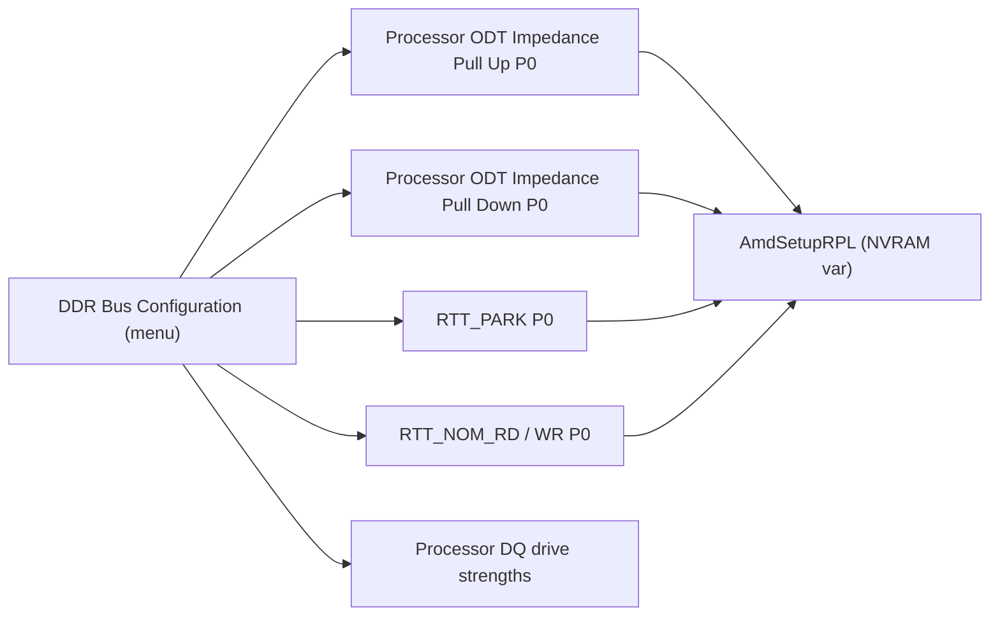
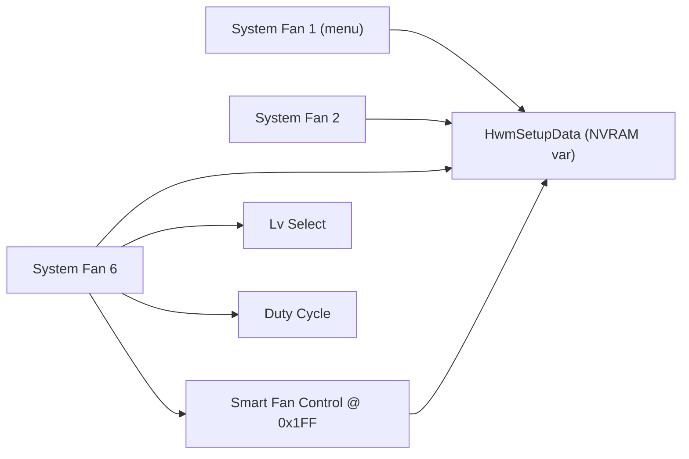
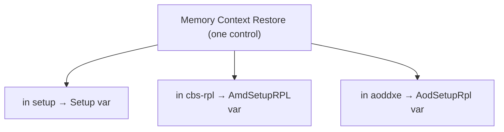
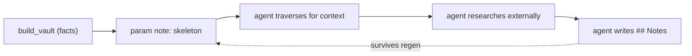

# Walkthroughs

Three tasks an agent ran against the MS-7E59 vault (AGESA 1.2.0.3g). Each enters the
graph a different way. The point of each is the mechanism: how the answer appears in
the graph, and why that grouping exists.

---

## 1. Find the knobs behind a tuning goal

**Task.** A board running four dual-rank DDR5 DIMMs (two per channel) is stable but
will not train EXPO. The relevant settings are the termination and drive-strength
knobs, which have poor documentation and inconsistent names.

**Traversal.** The agent does not know this board's term for processor ODT, so it
searches by concept rather than by name:

- `vault.search content:ProcODT` → nothing. The board does not use that word.
- `vault.search content:impedance` → the ODT family across four variables
  (`Setup`, `AmdSetupRPL`, `AodSetupRpl`, `AmdSetupPHX`). The board's label is
  *Processor ODT Impedance Pull Up/Down*.
- `graph.neighbors forms/cbs-rpl/DDR_Bus_Configuration_cbs-rpl.md` → 70 settings:
  the RTT family (`RTT_PARK`, `RTT_NOM_RD/WR`, `RTT_WR`, `DQS_RTT_PARK`),
  `Processor ODT Impedance Pull Up/Down`, `CK/CS/CA ODT GroupA/B`, and the DQ/CK/CA
  drive strengths.
- `vault.read` of `Processor ODT Impedance Pull Up P0` →
  `AmdSetupRPL` offset `0x3D2`, 8-bit, with the option bytes decoded to ohms
  (`28 = 40Ω`, `14 = 48Ω`, `12 = 60Ω`, `255 = Auto`).

The whole signal-integrity surface arrives in one hop from the menu, and the leaf
note gives the byte and the offset.

**Why it works.** The IFR binds every question to a form (menu) and to a
(VarStore, offset). The generator makes both the form and the variable into nodes.
So the menu node aggregates everything that menu shows, and the variable node
aggregates everything stored together. Content search supplies the third route, from
the user's word to the firmware's word.

---

## 2. Understand a subsystem the OS also drives

**Task.** A Linux fan driver (`nct6687`) controls the board's system fans. The BIOS
configures the same Nuvoton chip. Read the BIOS's fan model.

**Traversal.** Enter by structure, not search:

- `vault.search Smart Fan` → one form per fan (`System Fan 1` … `System Fan 6`),
  all in the `setup` module, all tagged `#domain/thermal-fan`.
- `vault.read System Fan 6 Smart Fan Control` → menu `System Fan 6`, section
  `SmartFan - Lv Select - DutyCycle`, variable `HwmSetupData` offset `0x1FF`,
  options `Disabled`/`Enabled`.

Each fan repeats the same form shape (a SmartFan toggle, level selects, duty
cycles), and every one binds to the single `HwmSetupData` variable. The `var` node
for `HwmSetupData` lists those parameters by offset — the layout of the BIOS's fan
model in NVRAM, against the same chip the driver programs.

**Why it works.** Repeated hardware (six identical fan headers) produces repeated
forms in the IFR. The shared variable node collects them into one offset map. That
map is comparable, offset by offset, with the chip's register space — a path from
the vendor firmware's own configuration to the OS driver that targets the same
silicon.

---

## 3. The same setting in more than one menu

**Task.** A saved overclock profile changed memory behaviour. Which menu's toggle
actually wrote NVRAM?

**Traversal.** Search by concept across the whole vault:

- `vault.search Context Restore` → `Memory Context Restore` in four places:
  the `setup` module, `cbs-rpl` (AMD CBS), `aoddxe` (AMD Overclocking), and a
  `DDR Memory Features` form.
- The same pattern holds for other controls. `Precision Boost Overdrive` appears in
  both `setup` and `aoddxe`; `Processor ODT Impedance` in both CBS and AOD.

One control, several nodes — each in a different module, each bound to a different
variable. The agent distinguishes them by their `var` node and offset.

**Why it works.** AGESA exposes a setting through more than one form module, and
each module is a separate formset with its own VarStore. The graph keeps them
distinct because they are distinct: same name, different storage. To answer "where
did my setting go," compare the variables, not the labels.

A note on search: the exact-phrase `content:"Memory Context Restore"` returned
nothing here, while the ranked `Context Restore` returned all four. One query mode is
not enough; cross-check with another, and with structural traversal.

---

## Hydrating, then enriching

The generated note is a skeleton: name, help text, decoded options, variable, offset,
tags, and links. It states what the firmware declares, nothing more.

A reasoning agent can build on that. It traverses to establish context, researches
outside the vault (datasheets, JEDEC DDR5, AGESA notes, driver source), and writes
its conclusions into the note's `## Notes` section. That section is preserved when
the vault is regenerated, and Obsidian renders Mermaid inside it, so prose and
diagrams both persist.

Two examples from the walkthroughs above:

- On `Processor ODT Impedance Pull Up P0`, record the byte→ohm reasoning, the values
  that held at this DIMM configuration, and a diagram of the pull-up/pull-down/RTT
  relationship.
- On the `HwmSetupData` fan offsets, record the matching `nct6687` registers, so the
  BIOS map and the driver map sit side by side.

The split is deliberate: the generator owns the facts and overwrites them on every
run; the `## Notes` section owns the understanding and is never overwritten. Over
time the vault holds both — the firmware's declarations and the research built on
them.
