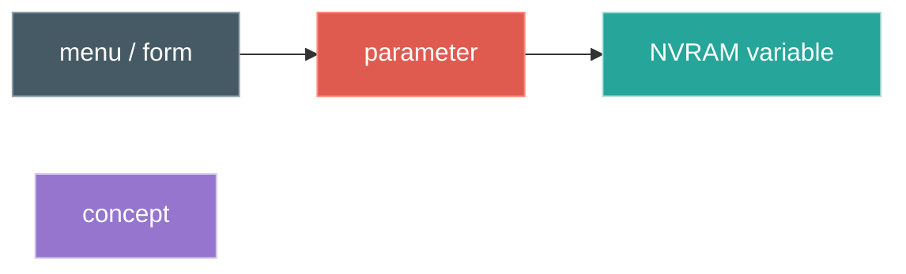
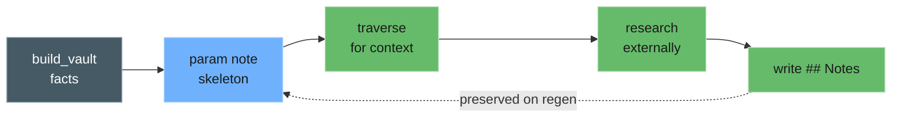

# Walkthroughs

Three tasks run against the MS-7E59 vault (AGESA 1.2.0.3g). Each enters the graph a
different way and ends in a different kind of change. The discovery is the means; the
change is the reason to do it at all.

| Walkthrough | Enters by | Ends in a change |
|-------------|-----------|------------------|
| [1. Find the knobs behind a tuning goal](walkthroughs/01-tuning-goal.md) | meaning (search) | **tune** — set termination by hand where EXPO can't |
| [2. Understand a subsystem the OS also drives](walkthroughs/02-subsystem-driver.md) | structure | **fix** — correct a Linux driver against the vendor firmware |
| [3. The same setting in more than one menu](walkthroughs/03-setting-across-menus.md) | meaning, vault-wide | **reconcile** — set the variable that actually governs |
| [4. Enrich a note with research](walkthroughs/04-enrichment.md) | traversal + research | **annotate** — durable findings written back into the vault |
| [5. Extend the driver to match the firmware](walkthroughs/05-driver-extension.md) | applies 2 + 4 | **ground** — a driver matched to the firmware's own model |

The shape is the same each time: enter through whichever grouping fits the question
(by meaning, by menu, by variable, by domain), reach the setting, read its variable
and offset, and make a deliberate change — a memory tune, a driver patch, a corrected
setting. The graph removes the part that is usually guesswork: which knob, what legal
values, which storage location. The operator still decides and verifies; nothing here
flashes firmware.

## Reading the diagrams

The scenario diagrams share a colour language:

Parameter nodes take their domain's colour (red for ODT, orange for thermal/fan,
amber for timings, and so on — the same palette the Obsidian graph uses).

## The walk diagrams

Each walkthrough includes a small **walk diagram**: circles are the actual Obsidian
notes the agent read, and arrows are its MCP moves — `search`, `neighbors`, `read`.

These are not a product of generating the vault. The generator emits notes and the
links between them, but it does not choose a route through them. A walk diagram is the
trace of how the agent moved across the graph to assemble the answer to one question.
A different question traces a different path over the same notes — the graph is the
substrate; the walk is the reasoning.

## Hydrating, then enriching

The generated note is a skeleton: name, help text, decoded options, variable, offset,
tags, and links. It states what the firmware declares, nothing more.

A reasoning agent builds on that. It traverses to establish context, researches
outside the vault (datasheets, JEDEC DDR5, AGESA notes, driver source), and writes
its conclusions into the note's `## Notes` section. That section is preserved when the
vault is regenerated, and Obsidian renders Mermaid inside it, so prose and diagrams
both persist.

Two examples from the walkthroughs:

- On `Processor ODT Impedance Pull Up P0`, record the byte→ohm reasoning, the values
  that held at this DIMM configuration, and a diagram of the pull-up/pull-down/RTT
  relationship.
- On the `HwmSetupData` fan offsets, record the matching `nct6687` registers, so the
  BIOS map and the driver map sit side by side.

The split is deliberate. The generator owns the facts and overwrites them on every
run; the `## Notes` section owns the understanding and is never overwritten. Over time
the vault holds both — the firmware's declarations and the research built on them.

[Walkthrough 4](walkthroughs/04-enrichment.md) is a worked, MCP-written example (with
the [real note](examples/HwmSetupData.md) captured for reference);
[walkthrough 5](walkthroughs/05-driver-extension.md) applies the result to extend an
out-of-tree driver.
