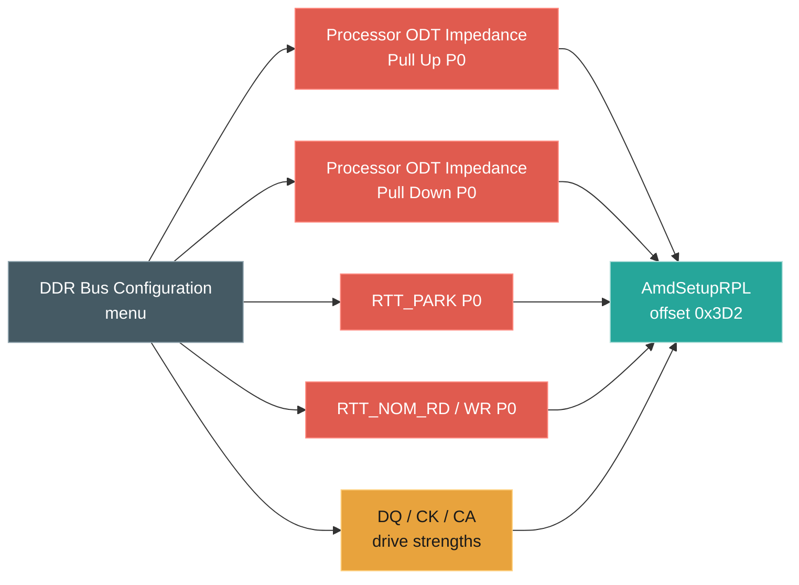

# Walkthrough: find the knobs behind a tuning goal

**Task.** A board running four dual-rank DDR5 DIMMs (two per channel) is stable but
will not train EXPO. The settings that matter are the termination and drive-strength
knobs, which have poor documentation and inconsistent names.

**Entry: by meaning.** The agent does not know this board's term for processor ODT,
so it searches by concept:

- `vault.search content:ProcODT` → nothing. The board does not use that word.
- `vault.search content:impedance` → the ODT family across four variables
  (`Setup`, `AmdSetupRPL`, `AodSetupRpl`, `AmdSetupPHX`). The board's label is
  *Processor ODT Impedance Pull Up/Down*.

**Cross to structure.** From the menu node, one hop returns the whole cluster:

- `graph.neighbors forms/cbs-rpl/DDR_Bus_Configuration_cbs-rpl.md` → 70 settings:
  the RTT family (`RTT_PARK`, `RTT_NOM_RD/WR`, `RTT_WR`, `DQS_RTT_PARK`),
  `Processor ODT Impedance Pull Up/Down`, `CK/CS/CA ODT GroupA/B`, and the DQ/CK/CA
  drive strengths.

**Read the leaf.** `vault.read` of `Processor ODT Impedance Pull Up P0` gives
`AmdSetupRPL` offset `0x3D2`, 8-bit, with the option bytes decoded to ohms
(`28 = 40Ω`, `14 = 48Ω`, `12 = 60Ω`, `255 = Auto`). "Set pull-up to 40 Ω" is "write
byte `0x1C` to `AmdSetupRPL` offset `0x3D2`."

**Why it works.** The IFR binds every question to a form (menu) and to a
(VarStore, offset). The generator makes both into nodes. The menu node aggregates
everything that menu shows; the variable node aggregates everything stored together;
content search supplies the route from the user's word to the firmware's word. The
answer is one hop from any of the three.

**The change it enables.** EXPO is one profile, validated for a single DIMM per
channel. At two dual-rank DIMMs per channel the controller sees eight ranks and that
profile will not train; termination has to be set by hand. The discovery above is
the input to that change: pick candidate values for `Processor ODT Impedance Pull
Up/Down` and the `RTT_*` knobs (the option tables give the legal set), write them to
`AmdSetupRPL` by offset with `setup_var` — no flash, recoverable with a CMOS clear —
reboot, and run a memory stability test. If it fails, the graph already holds the
neighbouring knobs to try next. What the tool removes is the guesswork that usually
precedes the change: which knobs, what legal values, which variable. What remains is
a deliberate, verifiable tune.

See also: [agent traversal](../agent-traversal.md), [index](../walkthroughs.md).
