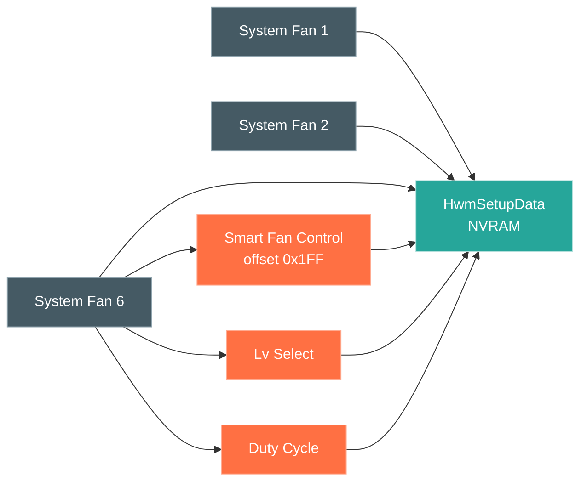

# Walkthrough: understand a subsystem the OS also drives

**Task.** The board's system fans are not fully controllable from Linux. The
`nct6687` driver assumes one PWM control register layout; this board uses another, so
writes to the system-fan PWM channels have no effect. To fix the driver you need the
board's actual fan model and the registers the firmware uses for it.

**Entry: by structure.** The BIOS configures the same Nuvoton chip the driver
targets, so read the BIOS's fan model directly:

- `vault.search Smart Fan` → one form per fan (`System Fan 1` … `System Fan 6`),
  all in the `setup` module, all tagged `#domain/thermal-fan`.
- `vault.read System Fan 6 Smart Fan Control` → menu `System Fan 6`, section
  `SmartFan - Lv Select - DutyCycle`, variable `HwmSetupData` offset `0x1FF`,
  options `Disabled`/`Enabled`.

Each fan repeats the same form shape (a SmartFan toggle, level selects, duty cycles),
and every one binds to the single `HwmSetupData` variable. The `var` node for
`HwmSetupData` lists those parameters by offset — the layout of the fan model in
NVRAM.

**Why it works.** Repeated hardware — six identical fan headers — produces repeated
forms in the IFR. The shared variable node collects them into one offset map. That
map is comparable, offset by offset, with the chip's register space.

**The change it enables.** The fix is a driver patch: correct the per-fan PWM
register table in `nct6687` so the system-fan channels respond. The BIOS fan model,
read here, plus the register writes in the firmware's Super-I/O module
(`SioDynamicSetup`), are the ground-truth source for that table — the vendor's own
programming of the chip, rather than values reverse-engineered from a Windows tool.
The discovery turns a guess-and-test driver change into one checked against the
firmware that already drives the hardware correctly.

See also: [agent traversal](../agent-traversal.md), [index](../walkthroughs.md).
