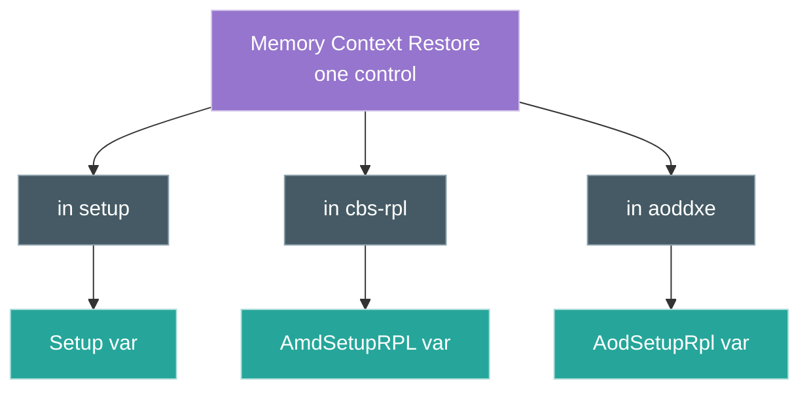

# Walkthrough: the same setting in more than one menu

**Task.** A change made in one BIOS menu did not take effect, or a saved overclock
profile altered memory behaviour and it is unclear which menu owns the setting. The
same control appears in several places, and they do not obviously agree.

**Entry: by meaning, across the whole vault.**

- `vault.search Context Restore` → `Memory Context Restore` in four places: the
  `setup` module, `cbs-rpl` (AMD CBS), `aoddxe` (AMD Overclocking), and a
  `DDR Memory Features` form.
- The pattern is common. `Precision Boost Overdrive` appears in both `setup` and
  `aoddxe`; `Processor ODT Impedance` in both CBS and AOD.

One control, several nodes — each in a different module, each bound to a different
variable. The agent separates them by their `var` node and offset.

**Why it works.** AGESA exposes a setting through more than one form module, and
each module is a separate formset with its own VarStore. The graph keeps the
instances distinct because they are distinct: same name, different storage. To find
where a setting lives, compare the variables, not the labels.

A note on search: the exact-phrase `content:"Memory Context Restore"` returned
nothing here, while the ranked `Context Restore` returned all four. One query mode is
not enough; cross-check with another, and with structural traversal.

**The change it enables.** Knowing the three instances write three different
variables tells you which one to set, and why one menu's toggle appeared to do
nothing — it wrote a variable the active path does not read, or another instance
overrode it. The change is editing the setting in the variable that actually governs,
and leaving the others alone. Without the graph this is the kind of thing found by
flipping a menu option, rebooting, and guessing; with it the storage location is
explicit before any change is made.

See also: [agent traversal](../agent-traversal.md), [index](../walkthroughs.md).
