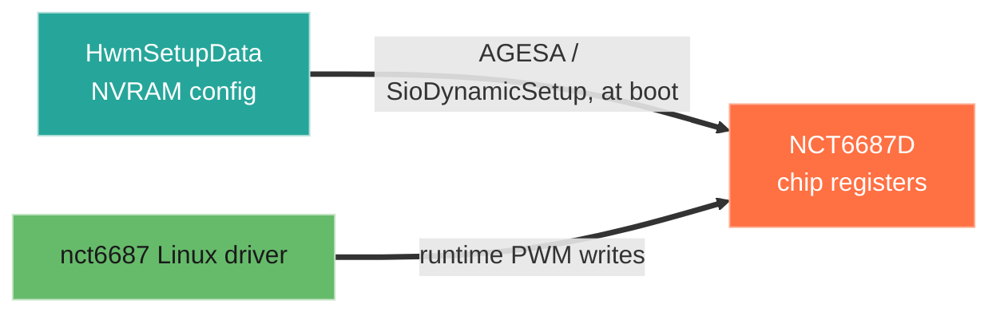
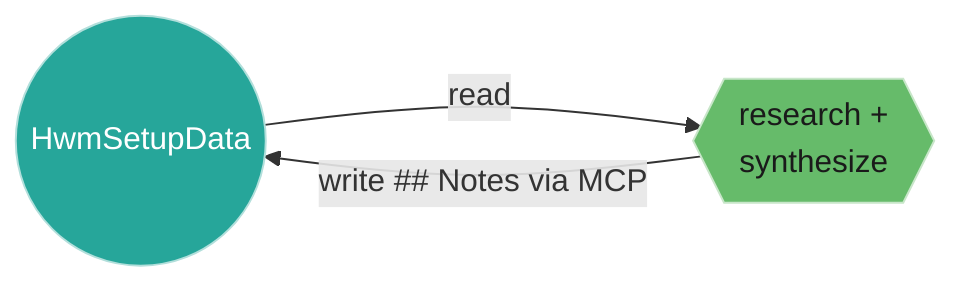

# Walkthrough: enrich a note with research

The first three walkthroughs read the vault. This one writes to it. The generated
note is a skeleton — name, options, variable, offset, links. An agent can add what
the firmware does not declare: context, external research, cross-references, and
diagrams, written into the note's `## Notes` section through the
[Semantic Vault MCP](https://community.obsidian.md/plugins/semantic-vault-mcp) edit
tool. That section is below the `<!-- END GENERATED -->` marker, so `make vault`
preserves it while it overwrites the generated facts above.

**Task.** Walkthrough 2 established that `HwmSetupData` holds the board's fan model
and that the `nct6687` driver targets the same chip. Record that correspondence on
the note so the next person starts from a cross-referenced map.

**Method.** Read the note, research the driver side, and append three sections under
`## Notes` via `edit` (`patch`, heading target `Notes`, `append`). Then `make vault`
and confirm the annotation is still there. It is.

## The annotation, as it now lives on `vars/HwmSetupData.md`

### The BIOS fan model

`HwmSetupData` (GUID `B4B6D1E7-...`, ~972 bytes) holds the board's fan-curve
configuration — what the BIOS programs into the Nuvoton NCT6687D at boot. The fan
roster and order, from the offset map in the note:

| Fan | Block start |
|-----|-------------|
| CPU Fan 1 | `0x0B` |
| PUMP Fan 1 | `0x4F` |
| PUMP_SYS Fan 1 | `0xC7` |
| System Fan 1–6 | `0x10F`, `0x13F`, `0x16F`, `0x19F`, `0x1CF`, `0x1FF` (stride `0x30`) |
| EZ Conn Fan | `0x2A7` |

Each block has the same shape: a Smart-Fan enable, a temperature source, seven
temperature/speed curve points plus a critical point, fan-type auto-detect, and step
up/down times. The six System Fans are evenly spaced 48 bytes apart.

### The driver side (`nct6687`)

| Fan | PWM register |
|-----|--------------|
| CPU / PUMP | `0xA28`, `0xA29` |
| System fans 1–6 | `0xC70`, `0xC58`, `0xC40`, `0xC28`, `0xC10`, `0xBF8` |

### Two address spaces, one set of fans

The `HwmSetupData` offsets are NVRAM setup-variable offsets; the `nct6687` registers
are the chip's hardware registers over the LPC/Super-I/O bus. Different address
spaces, same physical fans: the BIOS writes the chip registers from this NVRAM config
at boot (via AGESA / `SioDynamicSetup`); the OS driver writes the same chip registers
later.

The note corroborates the fan roster and order — CPU, PUMP, PUMP_SYS, System 1–6, EZ
Conn — and that there are six system fans, matching the driver's per-fan table. The
chip register addresses are not in the IFR; confirming them from `SioDynamicSetup`
rather than reverse engineering is the open follow-up.

> **The full note** — the complete `HwmSetupData` offset map (365 parameters) plus
> this annotation, exactly as it is in the vault — is captured at
> [`docs/examples/HwmSetupData.md`](../examples/HwmSetupData.md).

## The walk

The same walking of the graph, plus a write: the agent read the node, researched, and
wrote its findings back — all over the MCP.

## Why it works

The generated body and the annotation are separated by the `<!-- END GENERATED -->`
marker. `build_vault` rewrites everything above it on every run and re-appends
everything below it unchanged. So the generator stays authoritative for the facts
(offsets, options, the refreshed map) while research accumulates underneath and is
never lost to a regeneration. The edit goes through the MCP plugin, so the same agent
that traverses the graph also writes back to it.

## The change it enables

This is the durable form of walkthrough 2's finding. The fan walkthrough produced a
cross-reference in conversation; this writes it into the note, where it stays. The
next person fixing the driver opens one note and sees the BIOS fan model and the
driver's PWM registers side by side, plus the open task. Over many notes, the vault
becomes the firmware's declarations with the research built on them — the same
artifact, now carrying both.

A second instance: `Processor ODT Impedance Pull Up P0` (walkthrough 1) carries an
annotation with the byte→ohm reasoning, 2DPC starting points, and a termination
diagram, written and preserved the same way
([captured note](../examples/Processor_ODT_Impedance_Pull_Up_P0.md)).

## What did the synthesis

The traversal, the research, and the cross-referencing above were done by a coding
agent over the MCP, on this board's real data — not a template. The individual facts
existed already, but in different places and different address spaces: the fan model
in the IFR, the PWM registers in the driver source, the chip behaviour in datasheets
and scattered references. Connecting them into one coherent view, and recording it
where the next reader will find it, is the part that is normally slow and manual. A
working understanding that spans firmware, driver, and silicon is difficult to
assemble by hand; here it is a traversal and an annotation, and it persists.

See also: [agent traversal](../agent-traversal.md), [index](../walkthroughs.md).
