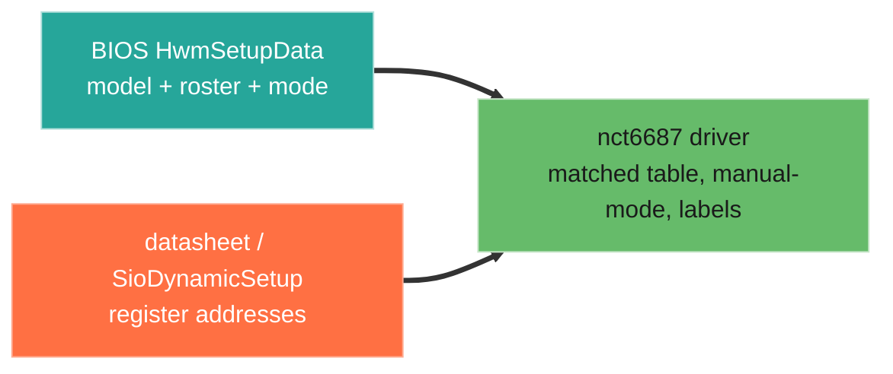

# Walkthrough: extend the driver to match the firmware

Walkthroughs 2 and 4 read the BIOS fan model and recorded it next to the `nct6687`
driver's register map. This one applies it: use the firmware's own model to extend
the out-of-tree driver, so the driver matches how the chip is actually configured
rather than how it was guessed. This is the reason to do the BIOS work — drivers
grounded in the firmware's reality.

## What the BIOS model tells the driver

Every fan block in `HwmSetupData` carries the same control fields:

- `Smart_Fan_Control` — auto curve enabled or not
- `current_fan_control_mode` — the active mode (auto/smart vs manual)
- `temperature_source_select` — which sensor drives this fan
- seven `level_*` temperature/speed points, plus a critical point
- `step_up_time` / `step_down_time`

And the roster is explicit: `CPU`, `PUMP`, `PUMP_SYS`, `System 1`–`6`, `EZ Conn`.

Three of these translate directly into driver changes.

## 1. Align the fan table to the firmware roster

The driver's per-fan config should enumerate the fans the firmware does, in the same
order, with the same labels. The contribution that added system-fan PWM already
carries the per-fan write registers; the BIOS roster confirms the full set and names:

```c
/* Roster from the BIOS HwmSetupData model: CPU, PUMP, PUMP_SYS, SYS1..6, EZ_CONN. */
static const struct nct6687_fan_config msi_x870_fans[] = {
    { .label = "CPU",  .reg_pwm_write = 0xA28 },
    { .label = "PUMP", .reg_pwm_write = 0xA29 },
    { .label = "SYS1", .reg_pwm_write = 0xC70 },
    { .label = "SYS2", .reg_pwm_write = 0xC58 },
    { .label = "SYS3", .reg_pwm_write = 0xC40 },
    { .label = "SYS4", .reg_pwm_write = 0xC28 },
    { .label = "SYS5", .reg_pwm_write = 0xC10 },
    { .label = "SYS6", .reg_pwm_write = 0xBF8 },
    /* PUMP_SYS and EZ_CONN are in the BIOS roster; add once their PWM
       registers are confirmed from the datasheet / SioDynamicSetup. */
};
```

The labels reported to `hwmon` now match what the board's firmware calls these
headers, instead of a generic `fanN`.

## 2. Force manual mode before writing PWM

The BIOS model gives every fan a `current_fan_control_mode`. When a fan is in the
chip's smart/auto mode, the NCT6687 drives PWM from its own curve and a host write to
the PWM register has no lasting effect — the original "writes do nothing" symptom,
beyond the wrong-register issue. The firmware model makes the fix explicit: take the
fan out of auto mode before driving it.

```c
/* The chip's auto curve will override host PWM writes. The BIOS programs a
 * per-fan control mode at boot; to take over, set manual first. The mode
 * register/value come from the NCT6687 datasheet (or SioDynamicSetup), not the IFR. */
static int nct6687_pwm_write(struct nct6687_data *data, int ch, u8 duty)
{
    nct6687_write(data, fans[ch].reg_mode, NCT6687_FAN_MODE_MANUAL);
    nct6687_write(data, fans[ch].reg_pwm_write, duty);
    return 0;
}
```

## 3. Expose the temperature source (optional)

`temperature_source_select` shows the chip can bind each fan to a chosen sensor. A
driver that reads and reports this — or lets the user set it — matches a capability
the firmware already uses, rather than leaving each fan's source opaque.

## Where the line is

The BIOS gives the **model and roster**: which fans exist, what controls each has,
what mode it boots in. It does not give the chip's hardware register addresses — those
are NVRAM setup-variable offsets, a different address space. The PWM and mode register
addresses come from the chip datasheet, from LibreHardwareMonitor, or from
disassembling the firmware's own Super-I/O module (`SioDynamicSetup`). The two
together ground the driver: the firmware says *what* and *what mode*, the datasheet
says *where*.



## The change it enables

A driver whose channel map, labels, and control behaviour follow the firmware's own
model: fans enumerated and named as the board defines them, PWM writes that hold
because the fan is taken out of auto mode first, and a clear path to temperature-source
and curve features the chip already supports. The starting point was a board where
system-fan PWM did nothing; the BIOS model turns the remaining work from guess-and-test
into changes checked against the firmware that drives the same silicon.

The driver this builds on:
[`Fred78290/nct6687d`](https://github.com/Fred78290/nct6687d). The illustrative
register values are from its MSI X870/B850/Z890 fan-control support.

See also: [enrichment](04-enrichment.md), [index](../walkthroughs.md).
